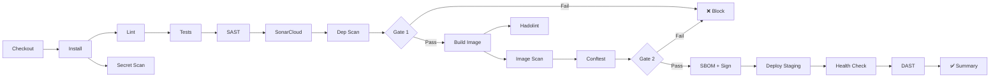

# Design and Implementation of a Secure DevSecOps CI/CD Pipeline with Automated Vulnerability Scanning

## Complete Project Blueprint — PFE

---

## TABLE OF CONTENTS

1. [Executive Summary](#1-executive-summary)
2. [Problem Statement](#2-problem-statement)
3. [Business Context and Motivation](#3-business-context-and-motivation)
4. [Project Objectives](#4-project-objectives)
5. [Functional Requirements](#5-functional-requirements)
6. [Non-Functional Requirements](#6-non-functional-requirements)
7. [Scope and Boundaries](#7-scope-and-boundaries)
8. [Complete Technical Architecture](#8-complete-technical-architecture)
9. [Technology Stack with Justification](#9-technology-stack-with-justification)
10. [Repository Folder Structure](#10-repository-folder-structure)
11. [Branching Strategy and Git Workflow](#11-branching-strategy-and-git-workflow)
12. [CI/CD Pipeline Design — Stage by Stage](#12-cicd-pipeline-design--stage-by-stage)
13. [Security Controls per Stage](#13-security-controls-per-stage)
14. [Security Gates and Blocking Conditions](#14-security-gates-and-blocking-conditions)
15. [Demo Application Design](#15-demo-application-design)
16. [Intentional Vulnerable Scenarios](#16-intentional-vulnerable-scenarios)
17. [Implementation Roadmap](#17-implementation-roadmap)
18. [Weekly Execution Plan](#18-weekly-execution-plan)
19. [Deliverables per Phase](#19-deliverables-per-phase)
20. [Risk Analysis and Mitigation](#20-risk-analysis-and-mitigation)
21. [KPIs and Evaluation Metrics](#21-kpis-and-evaluation-metrics)
22. [Testing Strategy](#22-testing-strategy)
23. [Reporting and Dashboard Strategy](#23-reporting-and-dashboard-strategy)
24. [Final Demo/Presentation Scenario](#24-final-demopresentation-scenario)
25. [PFE Report Chapter Structure](#25-pfe-report-chapter-structure)
26. [Future Improvements](#26-future-improvements)
27. [How to Score 10/10](#27-how-to-score-1010)
28. [Optional Advanced Enhancements](#28-optional-advanced-enhancements)
29. [Professional GitHub README Structure](#29-professional-github-readme-structure)
30. [Suggested Diagrams](#30-suggested-diagrams)
31. [Screenshots and Evidence to Collect](#31-screenshots-and-evidence-to-collect)
32. [Oral Presentation Structure](#32-oral-presentation-structure)
33. [Final Success Checklist](#33-final-success-checklist)

---

## 1. EXECUTIVE SUMMARY

This project designs and implements a complete DevSecOps CI/CD platform that embeds security controls at every stage of the software delivery lifecycle. Built around a deliberately vulnerable demo web application ("SecureTrack" — an incident reporting and tracking platform), the project demonstrates how automated security scanning, policy enforcement, and quality gates transform a standard CI/CD pipeline into a hardened, auditable software delivery system.

The pipeline automates 22 distinct stages — from source checkout through secret scanning, SAST, dependency auditing, container vulnerability analysis, SBOM generation, container signing, policy-as-code validation, staged deployment, and post-deployment DAST — each with explicit pass/fail gates. Every security finding is tracked, reported, and visualized through dashboards, creating a measurable before-and-after narrative: the application starts with 15+ intentional vulnerabilities and, through iterative pipeline-enforced remediation, reaches a hardened state with zero critical/high findings.

The technical stack uses GitHub Actions, Docker, SonarCloud, Gitleaks, Semgrep, Trivy, OWASP ZAP, Syft, Cosign, OPA/Conftest, and Prometheus/Grafana — all free-tier or open-source, making the project fully reproducible. The result is not just a workflow file; it is an integrated secure delivery ecosystem with architecture diagrams, threat models, compliance mappings, metrics dashboards, and professional documentation suitable for both academic evaluation and a DevSecOps engineering portfolio.

---

## 2. PROBLEM STATEMENT

Modern software organizations face a critical gap: **security is typically applied after code is written and deployed**, creating expensive remediation cycles, delayed releases, and undetected vulnerabilities in production.

Specific problems this project addresses:

1. **Late-stage vulnerability discovery**: Traditional security audits occur post-development. A 2024 IBM study estimates the cost of fixing a vulnerability in production is 100x that of fixing it during development.

2. **Secret leakage**: API keys, database credentials, and tokens are regularly committed to version control. GitHub reported scanning over 100 million commits in 2023 and finding millions of exposed secrets.

3. **Supply-chain attacks**: Dependencies introduce transitive vulnerabilities. The Log4Shell incident (CVE-2021-44228) demonstrated how a single library vulnerability can compromise millions of systems.

4. **Container image risks**: Base images contain known vulnerabilities. A typical `node:latest` image carries 200+ known CVEs. Without scanning, these propagate silently to production.

5. **No enforcement mechanism**: Even when security tools exist, teams lack automated gates that block insecure code from progressing through the pipeline.

6. **No traceability**: Organizations cannot answer: "What security checks were performed on the artifact currently running in production?"

**This project solves these problems** by building a CI/CD pipeline where security is not an afterthought but an integral, automated, and enforced part of every build, with full traceability and measurable improvement over time.

---

## 3. BUSINESS CONTEXT AND MOTIVATION

### Industry Context
- **DevSecOps market** projected to reach $23.4 billion by 2028 (MarketsAndMarkets).
- **Regulatory pressure**: GDPR, SOC 2, ISO 27001, and PCI-DSS all require evidence of secure development practices.
- **Shift-left security** is now a standard expectation in engineering job descriptions.
- **Supply-chain security** mandated by executive orders (US EO 14028) requiring SBOMs for government software suppliers.

### Academic Motivation
- Combines DevOps, cybersecurity, software engineering, and cloud computing — demonstrating cross-domain mastery.
- Produces measurable, quantifiable results (vulnerability counts, coverage percentages, blocked builds).
- Creates a tangible, demonstrable artifact — not just a theoretical study.

### Professional Motivation
- Directly maps to high-demand roles: DevSecOps Engineer, Cloud Security Engineer, Platform Engineer.
- Portfolio piece that demonstrates practical skills employers value.
- Demonstrates maturity: security thinking, automation mindset, infrastructure awareness.

---

## 4. PROJECT OBJECTIVES

### Primary Objectives
| ID | Objective | Measurable Outcome |
|----|-----------|-------------------|
| O1 | Design a multi-stage CI/CD pipeline with integrated security | Pipeline with 22 stages, all automated |
| O2 | Implement automated security gates that block insecure code | 6+ gates with pass/fail enforcement |
| O3 | Demonstrate measurable vulnerability reduction | Before/after metrics showing >90% critical finding reduction |
| O4 | Generate supply-chain security artifacts | SBOM + signed container images per build |
| O5 | Implement post-deployment security validation | DAST scan on deployed staging application |
| O6 | Create observability for the security posture | Grafana dashboard with security metrics |

### Secondary Objectives
| ID | Objective | Measurable Outcome |
|----|-----------|-------------------|
| S1 | Implement policy-as-code for infrastructure rules | OPA/Conftest policies enforcing Dockerfile standards |
| S2 | Create a threat model for the demo application | STRIDE-based threat model document |
| S3 | Map controls to compliance frameworks | Mapping table to OWASP SDLC, NIST, ISO 27001 |
| S4 | Design a rollback and resilience strategy | Documented rollback procedure with health checks |

---

## 5. FUNCTIONAL REQUIREMENTS

| ID | Requirement | Priority |
|----|-------------|----------|
| FR01 | Pipeline triggers on push to `develop` and on pull requests to `main` | Must |
| FR02 | Secret scanning blocks pipeline on detection | Must |
| FR03 | SAST blocks pipeline on high/critical findings | Must |
| FR04 | Code quality analysis with SonarCloud quality gate | Must |
| FR05 | Dependency vulnerability scan with severity threshold | Must |
| FR06 | Docker image build and tag with commit SHA | Must |
| FR07 | Container image vulnerability scan with blocking | Must |
| FR08 | Deploy to staging only if all gates pass | Must |
| FR09 | Generate SBOM for every build | Should |
| FR10 | Sign container images with Cosign | Should |
| FR11 | Run DAST against staging after deployment | Should |
| FR12 | Policy-as-code validation for Dockerfile and configs | Should |
| FR13 | Generate pipeline summary report as artifact | Must |
| FR14 | Health check after staging deployment | Must |
| FR15 | Upload scan results as pipeline artifacts | Must |
| FR16 | Dashboard showing security findings over time | Should |

---

## 6. NON-FUNCTIONAL REQUIREMENTS

| ID | Requirement | Target |
|----|-------------|--------|
| NFR01 | Pipeline execution time | < 15 minutes for full pipeline |
| NFR02 | All tools must be free/open-source or free-tier | $0 cost |
| NFR03 | Pipeline must be reproducible from README instructions | < 30 minutes to set up from scratch |
| NFR04 | Container image size | < 200MB (production image) |
| NFR05 | Test coverage | > 70% line coverage |
| NFR06 | Documentation | Architecture + README + report |
| NFR07 | Security: no real secrets in repository | All secrets via GitHub Secrets or .env.example |
| NFR08 | Availability of staging after deploy | Health endpoint returns 200 within 60s |

---

## 7. SCOPE AND BOUNDARIES

### In Scope
- Full CI/CD pipeline with 22 stages
- Demo web application (SecureTrack — incident tracker)
- 7 categories of security controls (source, code, dependency, container, deployment, post-deploy, governance)
- Staging deployment via Docker Compose on a VM or local machine
- Observability with Prometheus + Grafana
- Documentation: architecture, threat model, compliance mapping
- Before/after security metrics
- Professional README and report

### Out of Scope
- Production deployment to cloud (AWS/GCP/Azure) — staging is sufficient
- Kubernetes orchestration — Docker Compose is used instead (justified: scope control)
- Full penetration testing — DAST baseline scan is included
- User management / RBAC for the pipeline itself — GitHub native permissions are used
- Performance / load testing — focus is security, not performance
- Mobile application — web only
- Multi-cloud deployment

### Boundaries
The project demonstrates the **methodology and tooling** of DevSecOps. It is not a full enterprise implementation. Trade-offs:
- SonarCloud free tier limits apply (public repo)
- OWASP ZAP baseline scan (not full active scan) to stay within reasonable execution time
- Cosign keyless signing via GitHub OIDC (simplest path, still production-valid)

---

## 8. COMPLETE TECHNICAL ARCHITECTURE

### High-Level Architecture

```
┌──────────────────────────────────────────────────────────────────┐
│                        DEVELOPER WORKSTATION                      │
│  ┌──────────┐  ┌──────────┐  ┌───────────────────┐              │
│  │ IDE +    │  │ Pre-     │  │ Local Docker      │              │
│  │ Linters  │  │ commit   │  │ Compose Testing   │              │
│  │          │  │ Hooks    │  │                   │              │
│  └────┬─────┘  └────┬─────┘  └───────────────────┘              │
│       │              │                                            │
│       └──────┬───────┘                                            │
│              │ git push                                           │
└──────────────┼────────────────────────────────────────────────────┘
               │
               ▼
┌──────────────────────────────────────────────────────────────────┐
│                         GITHUB PLATFORM                           │
│                                                                    │
│  ┌─────────────┐  ┌──────────────────┐  ┌──────────────────┐    │
│  │ Repository  │  │ Branch           │  │ GitHub Container │    │
│  │ + Secrets   │  │ Protection Rules │  │ Registry (GHCR)  │    │
│  └──────┬──────┘  └──────────────────┘  └──────────────────┘    │
│         │                                                         │
│         ▼                                                         │
│  ┌──────────────────────────────────────────────────────────┐    │
│  │              GITHUB ACTIONS CI/CD PIPELINE                │    │
│  │                                                            │    │
│  │  ┌─────────┐ ┌────────┐ ┌────────┐ ┌────────┐           │    │
│  │  │ Source  │→│ Build  │→│Security│→│  Gate  │           │    │
│  │  │ Phase   │ │ Phase  │ │ Scans  │ │Decision│           │    │
│  │  └─────────┘ └────────┘ └────────┘ └───┬────┘           │    │
│  │                                         │ pass            │    │
│  │                                         ▼                 │    │
│  │  ┌──────────┐ ┌──────────┐ ┌──────────────────┐         │    │
│  │  │ Package  │→│ Deploy   │→│ Post-Deploy      │         │    │
│  │  │ + Sign   │ │ Staging  │ │ Validation(DAST) │         │    │
│  │  └──────────┘ └──────────┘ └──────────────────┘         │    │
│  └──────────────────────────────────────────────────────────┘    │
└──────────────────────────────────────────────────────────────────┘
               │
               │ deploy via SSH / docker compose
               ▼
┌──────────────────────────────────────────────────────────────────┐
│                     STAGING ENVIRONMENT                            │
│                                                                    │
│  ┌──────────────────────────────────────────────────┐            │
│  │              Docker Compose Stack                  │            │
│  │                                                    │            │
│  │  ┌──────────┐  ┌──────────┐  ┌──────────┐       │            │
│  │  │ Frontend │  │ Backend  │  │ Database │       │            │
│  │  │ (React)  │  │ (Express)│  │(Postgres)│       │            │
│  │  │ :3000    │  │ :5000    │  │ :5432    │       │            │
│  │  └──────────┘  └──────────┘  └──────────┘       │            │
│  │                                                    │            │
│  │  ┌──────────┐  ┌──────────┐                      │            │
│  │  │Prometheus│  │ Grafana  │                      │            │
│  │  │ :9090    │  │ :3001    │                      │            │
│  │  └──────────┘  └──────────┘                      │            │
│  └──────────────────────────────────────────────────┘            │
│                                                                    │
│  ┌──────────────┐                                                │
│  │ OWASP ZAP   │  (runs against frontend/backend)               │
│  │ DAST Scan   │                                                 │
│  └──────────────┘                                                │
└──────────────────────────────────────────────────────────────────┘

                    ┌──────────────────────┐
                    │   EXTERNAL SERVICES  │
                    │                      │
                    │  ┌────────────────┐  │
                    │  │  SonarCloud    │  │
                    │  │  (Code Quality)│  │
                    │  └────────────────┘  │
                    └──────────────────────┘
```

### Pipeline Flow Architecture

```
Source Checkout
      │
      ▼
Install Dependencies ──→ Cache node_modules
      │
      ├──────────────────────────────────┐
      ▼                                  ▼
  Lint Code                       Secret Scan (Gitleaks)
      │                                  │
      ▼                                  │
  Unit Tests + Coverage                  │
      │                                  │
      ├──────────────────────────────────┘
      ▼
  SAST (Semgrep) ─────────────────────────┐
      │                                    │
      ▼                                    │
  Code Quality (SonarCloud) ──────────────┤
      │                                    │
      ▼                                    │
  Dependency Scan (Trivy fs + npm audit)──┤
      │                                    │
      ▼                                    ▼
  ┌─────────────────────────────────────────┐
  │         SECURITY GATE #1                 │
  │  All source/code checks must pass        │
  │  Secrets=0, SAST High=0, Sonar=pass,    │
  │  Critical deps=0                         │
  └─────────────────┬───────────────────────┘
                    │ PASS
                    ▼
  Build Docker Image
      │
      ├──────────────────────────────────┐
      ▼                                  ▼
  Dockerfile Lint (Hadolint)     Image Scan (Trivy image)
      │                                  │
      ▼                                  ▼
  SBOM Generation (Syft)         Policy Check (Conftest)
      │                                  │
      ├──────────────────────────────────┘
      ▼
  ┌─────────────────────────────────────────┐
  │         SECURITY GATE #2                 │
  │  Container checks must pass              │
  │  Image critical=0, Policy=pass,         │
  │  Hadolint=pass                           │
  └─────────────────┬───────────────────────┘
                    │ PASS
                    ▼
  Sign Image (Cosign) → Push to GHCR
                    │
                    ▼
  Deploy to Staging (docker compose)
                    │
                    ▼
  Health Check (curl /health)
                    │
                    ▼
  DAST Scan (OWASP ZAP baseline)
                    │
                    ▼
  ┌─────────────────────────────────────────┐
  │         FINAL REPORT                     │
  │  Aggregate all results                   │
  │  Upload artifacts                        │
  │  Post summary to PR                      │
  └─────────────────────────────────────────┘
```

---

## 9. TECHNOLOGY STACK WITH JUSTIFICATION

### Core Stack

| Category | Tool | Why This Tool | Alternatives Considered |
|----------|------|--------------|------------------------|
| **Source Control** | GitHub | Industry standard, free, integrates with Actions, GHCR, branch protection | GitLab (heavier, self-hosted complexity) |
| **CI/CD** | GitHub Actions | Native integration, free for public repos, extensive marketplace, YAML-based, OIDC support for Cosign | Jenkins (setup overhead), GitLab CI (requires GitLab) |
| **Containerization** | Docker | Universal standard for container images | Podman (less ecosystem support) |
| **Local Orchestration** | Docker Compose | Simple multi-container orchestration, perfect for staging | Kubernetes (overkill for staging demo) |
| **Container Registry** | GitHub Container Registry (GHCR) | Free, native to GitHub, supports OCI artifacts | Docker Hub (rate limits), ECR (AWS dependency) |
| **Code Quality** | SonarCloud | Free for open-source, quality gates, coverage tracking, technical debt analysis | CodeClimate (less security focus), Codacy |
| **Secret Scanning** | Gitleaks | Fast, configurable, supports custom rules, SARIF output, widely adopted | TruffleHog (slower), git-secrets (less maintained) |
| **SAST** | Semgrep | Fast, multi-language, community rules, low false-positive rate, SARIF output | Bandit (Python only), ESLint security (JS only) |
| **Dependency Scan** | Trivy (fs mode) + npm audit | Trivy: multi-ecosystem, fast, accurate CVE database. npm audit: native Node.js integration | Snyk (freemium limits), OWASP Dependency-Check (slower) |
| **Container Scan** | Trivy (image mode) | Same tool, consistent output, OCI support, fast | Grype (good but less integrated), Clair (complex setup) |
| **Dockerfile Lint** | Hadolint | Best-in-class Dockerfile linter, catches security issues | dockerfilelint (less rules) |
| **SBOM** | Syft | Anchore-backed, SPDX + CycloneDX output, integrates with Trivy/Grype | Trivy SBOM (less format options) |
| **Image Signing** | Cosign (Sigstore) | Keyless signing via GitHub OIDC, industry standard (used by Kubernetes, distroless) | Notary (complex setup) |
| **Policy-as-Code** | Conftest (OPA) | Rego language, tests any structured data (Dockerfile, YAML, JSON), well-documented | Checkov (more opinionated), Kics |
| **DAST** | OWASP ZAP (baseline) | Free, industry standard, Docker-based, baseline scan is fast, SARIF output | Nikto (less capable), Burp (commercial) |
| **Monitoring** | Prometheus + Grafana | Industry standard for metrics + visualization, free, Docker-based | Datadog (commercial), ELK (heavier) |

### Demo Application Stack

| Component | Technology | Why |
|-----------|-----------|-----|
| **Backend** | Node.js 20 LTS + Express.js | Widely used, fast to develop, rich security scanning rules in Semgrep |
| **Frontend** | React 18 (Vite) | Modern, fast build, large ecosystem |
| **Database** | PostgreSQL 16 | Production-grade, free, well-supported |
| **ORM** | Prisma | Type-safe, migration support, good for demo |
| **Testing** | Jest + Supertest (backend), Vitest (frontend) | Standard for Node.js ecosystem |
| **API Spec** | REST with basic JWT auth | Simple, sufficient for security demo |

---

## 10. REPOSITORY FOLDER STRUCTURE

```
securetrack-devsecops/
│
├── .github/
│   ├── workflows/
│   │   ├── ci-pipeline.yml              # Main CI pipeline (PR + develop push)
│   │   ├── cd-deploy.yml                # Deployment pipeline (staging)
│   │   ├── dast-scan.yml                # Post-deploy DAST scan
│   │   └── scheduled-scan.yml           # Weekly scheduled security scan
│   ├── CODEOWNERS                        # Code review requirements
│   └── pull_request_template.md          # PR template with security checklist
│
├── app/
│   ├── backend/
│   │   ├── src/
│   │   │   ├── controllers/
│   │   │   │   ├── authController.js
│   │   │   │   ├── incidentController.js
│   │   │   │   └── healthController.js
│   │   │   ├── middleware/
│   │   │   │   ├── auth.js
│   │   │   │   ├── errorHandler.js
│   │   │   │   └── rateLimiter.js
│   │   │   ├── models/
│   │   │   │   ├── user.js
│   │   │   │   └── incident.js
│   │   │   ├── routes/
│   │   │   │   ├── authRoutes.js
│   │   │   │   ├── incidentRoutes.js
│   │   │   │   └── healthRoutes.js
│   │   │   ├── services/
│   │   │   │   ├── authService.js
│   │   │   │   └── incidentService.js
│   │   │   ├── utils/
│   │   │   │   └── logger.js
│   │   │   └── app.js
│   │   ├── tests/
│   │   │   ├── unit/
│   │   │   │   ├── authService.test.js
│   │   │   │   ├── incidentService.test.js
│   │   │   │   └── middleware.test.js
│   │   │   └── integration/
│   │   │       ├── auth.test.js
│   │   │       └── incidents.test.js
│   │   ├── prisma/
│   │   │   ├── schema.prisma
│   │   │   └── migrations/
│   │   ├── Dockerfile
│   │   ├── .dockerignore
│   │   ├── package.json
│   │   ├── jest.config.js
│   │   └── .env.example
│   │
│   └── frontend/
│       ├── src/
│       │   ├── components/
│       │   │   ├── Login.jsx
│       │   │   ├── Dashboard.jsx
│       │   │   ├── IncidentList.jsx
│       │   │   ├── IncidentForm.jsx
│       │   │   └── Navbar.jsx
│       │   ├── services/
│       │   │   └── api.js
│       │   ├── App.jsx
│       │   └── main.jsx
│       ├── tests/
│       │   └── components/
│       │       ├── Login.test.jsx
│       │       └── Dashboard.test.jsx
│       ├── Dockerfile
│       ├── .dockerignore
│       ├── package.json
│       ├── vite.config.js
│       └── vitest.config.js
│
├── security/
│   ├── gitleaks/
│   │   └── .gitleaks.toml                # Gitleaks configuration
│   ├── semgrep/
│   │   └── .semgrep.yml                  # Custom Semgrep rules
│   ├── trivy/
│   │   ├── trivy.yaml                    # Trivy configuration
│   │   └── .trivyignore                  # Known accepted risks
│   ├── policies/
│   │   ├── dockerfile-policy.rego         # OPA policy for Dockerfiles
│   │   ├── pipeline-policy.rego           # OPA policy for pipeline config
│   │   └── test/
│   │       └── dockerfile_test.rego       # Policy unit tests
│   ├── zap/
│   │   └── zap-baseline.conf             # ZAP scan configuration
│   └── threat-model/
│       └── threat-model.md                # STRIDE threat model document
│
├── infrastructure/
│   ├── docker-compose.yml                 # Full staging stack
│   ├── docker-compose.monitoring.yml      # Prometheus + Grafana stack
│   ├── prometheus/
│   │   └── prometheus.yml                 # Prometheus scrape config
│   └── grafana/
│       ├── provisioning/
│       │   ├── dashboards/
│       │   │   └── devsecops-dashboard.json
│       │   └── datasources/
│       │       └── prometheus.yml
│       └── dashboards/
│           └── security-metrics.json
│
├── scripts/
│   ├── setup.sh                           # One-command local setup
│   ├── deploy-staging.sh                  # Staging deployment script
│   ├── health-check.sh                    # Post-deploy health verification
│   ├── generate-report.sh                 # Aggregate security reports
│   └── seed-vulnerabilities.sh            # Reset demo to vulnerable state
│
├── reports/                               # .gitignored — generated scan outputs
│   └── .gitkeep
│
├── docs/
│   ├── architecture.md                    # Architecture documentation
│   ├── security-controls.md               # Security controls inventory
│   ├── compliance-mapping.md              # Controls → standards mapping
│   ├── runbook.md                         # Operations runbook
│   └── images/
│       ├── architecture-diagram.png
│       ├── pipeline-flow.png
│       └── threat-model-diagram.png
│
├── evidence/                              # Screenshots and proof
│   ├── before-remediation/
│   ├── after-remediation/
│   ├── blocked-builds/
│   ├── passed-builds/
│   └── dashboards/
│
├── .gitignore
├── .pre-commit-config.yaml                # Pre-commit hooks config
├── .editorconfig
├── LICENSE
└── README.md
```

---

## 11. BRANCHING STRATEGY AND GIT WORKFLOW

### Branch Model: GitHub Flow with Protected Main

```
main (protected)
  │
  ├── develop (integration)
  │     │
  │     ├── feature/ST-001-user-auth
  │     ├── feature/ST-002-incident-crud
  │     ├── feature/ST-003-dashboard
  │     ├── fix/ST-010-sql-injection-patch
  │     └── security/ST-020-harden-dockerfile
  │
  └── hotfix/critical-secret-removal
```

### Branch Rules

| Branch | Protection Rules | CI Triggers |
|--------|-----------------|-------------|
| `main` | Require PR, require 1 review, require status checks (CI pass), no direct push, require signed commits (optional) | Deploy to staging on merge |
| `develop` | Require PR from feature branches, require CI pass | Full CI pipeline |
| `feature/*` | No protection, developer branches | CI on push (linting + tests + security scans) |
| `hotfix/*` | Can PR directly to main | Full CI pipeline |

### Pull Request Workflow

1. Developer creates `feature/ST-XXX-description` from `develop`
2. Developer pushes code → CI pipeline runs automatically
3. CI results posted as PR status checks and comments
4. Security gate results visible in PR (Gitleaks, Semgrep, Trivy results)
5. If all checks pass + review approved → merge to `develop`
6. `develop` → `main` via PR when release-ready → triggers staging deploy

### Why This Supports DevSecOps Governance
- **Enforcement**: No code reaches `main` without passing security gates
- **Traceability**: Every change is linked to a PR with security scan results
- **Auditability**: Git history + PR comments create a security audit trail
- **Separation of concerns**: Feature development is isolated from release branches
- **Rollback**: Any merge can be reverted since main is always functional

---

## 12. CI/CD PIPELINE DESIGN — STAGE BY STAGE

### Stage 1: Source Checkout
- **Purpose**: Clone the repository at the correct commit/branch
- **Tool**: `actions/checkout@v4`
- **Inputs**: Repository, branch, commit SHA
- **Outputs**: Full source tree in runner workspace
- **Fail conditions**: None (infrastructure failure only)
- **Evidence**: Commit SHA logged

### Stage 2: Setup Runtime
- **Purpose**: Install Node.js with deterministic version
- **Tool**: `actions/setup-node@v4` with node 20.x
- **Inputs**: `.nvmrc` or explicit version
- **Outputs**: Node.js and npm available in PATH
- **Fail conditions**: Setup failure
- **Evidence**: Node version logged

### Stage 3: Dependency Installation
- **Purpose**: Install all project dependencies deterministically
- **Tool**: `npm ci` (clean install from lockfile)
- **Inputs**: `package.json`, `package-lock.json`
- **Outputs**: `node_modules/`, dependency cache
- **Fail conditions**: Lockfile mismatch, install failure
- **Evidence**: Install log, cache status

### Stage 4: Linting
- **Purpose**: Enforce code style and catch basic errors
- **Tool**: ESLint with security plugin (`eslint-plugin-security`)
- **Inputs**: Source code
- **Outputs**: Lint report
- **Fail conditions**: Any error-level lint violations
- **Evidence**: ESLint output

### Stage 5: Unit Tests
- **Purpose**: Verify application logic correctness
- **Tool**: Jest (backend), Vitest (frontend)
- **Inputs**: Source code, test files
- **Outputs**: Test results, JUnit XML report
- **Fail conditions**: Any test failure
- **Evidence**: Test report uploaded as artifact

### Stage 6: Coverage Report
- **Purpose**: Measure test coverage and upload to SonarCloud
- **Tool**: Jest `--coverage` with lcov output
- **Inputs**: Test run output
- **Outputs**: `coverage/lcov.info`, coverage summary
- **Fail conditions**: Coverage below threshold (70%)
- **Evidence**: Coverage report artifact, SonarCloud coverage display

### Stage 7: Secret Scanning (Gitleaks)
- **Purpose**: Detect secrets, API keys, tokens, passwords in source code and git history
- **Tool**: `gitleaks/gitleaks-action@v2`
- **Inputs**: Full repository (including git history)
- **Outputs**: SARIF report, JSON findings
- **Fail conditions**: **BLOCKING** — any secret detected = pipeline fails
- **Evidence**: Gitleaks SARIF report uploaded as artifact + GitHub Security tab

### Stage 8: SAST (Semgrep)
- **Purpose**: Detect security vulnerabilities in source code (SQL injection, XSS, insecure crypto, etc.)
- **Tool**: `returntocorp/semgrep-action` with `p/security-audit` + `p/nodejs` rulesets
- **Inputs**: Source code
- **Outputs**: SARIF report, JSON findings with severity
- **Fail conditions**: **BLOCKING** — any HIGH or CRITICAL finding = pipeline fails
- **Evidence**: Semgrep SARIF uploaded to GitHub Security tab

### Stage 9: Code Quality Analysis (SonarCloud)
- **Purpose**: Measure code quality, maintainability, duplication, and enforce quality gate
- **Tool**: `SonarSource/sonarcloud-github-action@master`
- **Inputs**: Source code, coverage report (lcov.info)
- **Outputs**: SonarCloud analysis, quality gate status
- **Fail conditions**: **BLOCKING** — SonarCloud quality gate fails
- **Evidence**: SonarCloud badge, quality gate status in PR

### Stage 10: Dependency Vulnerability Scan
- **Purpose**: Detect known CVEs in project dependencies
- **Tool**: `aquasecurity/trivy-action` in `fs` mode + `npm audit --audit-level=high`
- **Inputs**: `package-lock.json`, `node_modules/`
- **Outputs**: Trivy JSON/SARIF report, npm audit output
- **Fail conditions**: **BLOCKING** — any CRITICAL dependency vulnerability
- **Evidence**: Trivy dependency report artifact

### Stage 11: Build Docker Image
- **Purpose**: Build the production container image
- **Tool**: `docker/build-push-action@v5` (BuildKit)
- **Inputs**: `Dockerfile`, application source
- **Outputs**: Docker image tagged with commit SHA and `latest`
- **Fail conditions**: Build failure
- **Evidence**: Image SHA, build log

### Stage 12: Dockerfile Best-Practice Validation (Hadolint)
- **Purpose**: Lint Dockerfile for security and best-practice violations
- **Tool**: `hadolint/hadolint-action@v3`
- **Inputs**: `Dockerfile`
- **Outputs**: Hadolint report
- **Fail conditions**: Any ERROR-level rule (e.g., DL3006 no tag, DL3002 root user)
- **Evidence**: Hadolint output

### Stage 13: Container Image Scan (Trivy)
- **Purpose**: Detect OS and library vulnerabilities in the built container image
- **Tool**: `aquasecurity/trivy-action` in `image` mode
- **Inputs**: Built Docker image
- **Outputs**: Trivy image scan report (JSON + SARIF + table)
- **Fail conditions**: **BLOCKING** — any CRITICAL vulnerability in image
- **Evidence**: Trivy image report artifact

### Stage 14: SBOM Generation
- **Purpose**: Generate Software Bill of Materials for supply-chain transparency
- **Tool**: `anchore/sbom-action@v0` (uses Syft)
- **Inputs**: Built Docker image
- **Outputs**: SBOM in SPDX and CycloneDX formats
- **Fail conditions**: Generation failure only
- **Evidence**: SBOM files uploaded as artifacts

### Stage 15: Container Image Signing
- **Purpose**: Cryptographically sign the image to verify its integrity and provenance
- **Tool**: `sigstore/cosign-installer` + `cosign sign` with GitHub OIDC (keyless)
- **Inputs**: Image digest from GHCR
- **Outputs**: Signed image in registry with Rekor transparency log entry
- **Fail conditions**: Signing failure
- **Evidence**: Cosign verification command output, Rekor entry URL

### Stage 16: Policy-as-Code Validation
- **Purpose**: Enforce organizational security policies on Dockerfile and configurations
- **Tool**: `open-policy-agent/conftest` (GitHub Action or Docker)
- **Inputs**: `Dockerfile`, `docker-compose.yml`
- **Outputs**: Policy evaluation results
- **Fail conditions**: **BLOCKING** — any policy violation (e.g., runs as root, no healthcheck)
- **Evidence**: Conftest output

### Stage 17: Push Image to Registry
- **Purpose**: Publish the validated, signed image to GHCR
- **Tool**: `docker/build-push-action@v5` with `push: true`
- **Inputs**: Built and scanned image
- **Outputs**: Image pushed to `ghcr.io/<org>/securetrack-backend:sha-xxxxx`
- **Fail conditions**: Push auth failure
- **Evidence**: Image URL and digest

### Stage 18: Deploy to Staging
- **Purpose**: Deploy the validated application to the staging environment
- **Tool**: SSH + `docker compose pull && docker compose up -d` OR GitHub self-hosted runner
- **Inputs**: `docker-compose.yml`, image from GHCR
- **Outputs**: Running application stack
- **Fail conditions**: Deployment script failure
- **Evidence**: Deployment log, deployed image SHA

### Stage 19: Post-Deployment Health Check
- **Purpose**: Verify the deployed application is running and healthy
- **Tool**: `curl` script with retry logic (up to 60s)
- **Inputs**: Staging URL + `/api/health` endpoint
- **Outputs**: HTTP 200 with health status JSON
- **Fail conditions**: Health endpoint not responding within 60s
- **Evidence**: Health check response

### Stage 20: DAST Scan (OWASP ZAP)
- **Purpose**: Scan the running application for runtime vulnerabilities (XSS, headers, misconfigurations)
- **Tool**: `zaproxy/action-baseline@v0.12.0`
- **Inputs**: Staging URL
- **Outputs**: ZAP HTML + JSON + SARIF report
- **Fail conditions**: WARN on high-severity findings (configurable to FAIL)
- **Evidence**: ZAP report artifact

### Stage 21: Publish Reports/Artifacts
- **Purpose**: Upload all security reports as GitHub Actions artifacts for download
- **Tool**: `actions/upload-artifact@v4`
- **Inputs**: All generated reports (SARIF, JSON, HTML, SBOM, coverage)
- **Outputs**: Downloadable artifacts in GitHub Actions run
- **Fail conditions**: None
- **Evidence**: Artifact URLs

### Stage 22: Final Decision Summary
- **Purpose**: Generate a human-readable summary of all security checks
- **Tool**: Custom bash script or GitHub Actions step summary
- **Inputs**: All previous stage results
- **Outputs**: Markdown table posted to `$GITHUB_STEP_SUMMARY` and PR comment
- **Fail conditions**: None (summary only)
- **Evidence**: Summary visible in GitHub Actions run page and PR

**Sample Summary Output:**
```
## 🔒 Security Pipeline Summary

| Check              | Tool      | Status | Findings |
|--------------------|-----------|--------|----------|
| Secret Scan        | Gitleaks  | ✅ PASS | 0 secrets |
| SAST               | Semgrep   | ✅ PASS | 0 high/crit |
| Code Quality       | SonarCloud| ✅ PASS | Gate passed |
| Dependency Scan    | Trivy     | ✅ PASS | 0 critical |
| Image Scan         | Trivy     | ✅ PASS | 0 critical |
| Dockerfile Lint    | Hadolint  | ✅ PASS | 0 errors |
| Policy Check       | Conftest  | ✅ PASS | 0 violations |
| DAST               | ZAP       | ⚠️ WARN | 2 low |

**Decision: DEPLOY APPROVED**
**Image: ghcr.io/anas/securetrack-backend:sha-a1b2c3d**
**SBOM: securetrack-sbom-spdx.json**
**Signature: verified via Rekor**
```

---

## 13. SECURITY CONTROLS PER STAGE

| Pipeline Stage | Security Control | Control Type | OWASP Category |
|---------------|-----------------|-------------|----------------|
| Pre-commit | Gitleaks pre-commit hook | Preventive | Secrets Management |
| Source | Branch protection + PR reviews | Preventive | Access Control |
| Source | Gitleaks scan | Detective | Secrets Management |
| Build | ESLint security plugin | Preventive | Secure Coding |
| Build | Semgrep SAST | Detective | Vulnerability Detection |
| Build | SonarCloud quality gate | Detective | Code Quality |
| Dependencies | Trivy fs scan | Detective | Supply Chain Security |
| Dependencies | npm audit | Detective | Supply Chain Security |
| Container | Hadolint | Preventive | Container Security |
| Container | Trivy image scan | Detective | Container Security |
| Container | Conftest policy | Preventive | Policy Enforcement |
| Supply Chain | Syft SBOM | Transparency | Supply Chain Security |
| Supply Chain | Cosign signing | Integrity | Supply Chain Security |
| Deployment | Security gate check | Preventive | Deployment Security |
| Deployment | Health check | Detective | Availability |
| Post-deploy | OWASP ZAP DAST | Detective | Runtime Security |
| Monitoring | Prometheus + Grafana | Detective | Continuous Monitoring |

---

## 14. SECURITY GATES AND BLOCKING CONDITIONS

### Gate 1: Source Security Gate (after Stage 7)
```yaml
conditions:
  - gitleaks_findings == 0         # Zero tolerance for secrets
gate_action: BLOCK pipeline
```

### Gate 2: Code Security Gate (after Stages 8-10)
```yaml
conditions:
  - semgrep_high_critical == 0     # No high/critical SAST findings
  - sonarcloud_quality_gate == "passed"
  - trivy_critical_deps == 0       # No critical dependency CVEs
gate_action: BLOCK pipeline
```

### Gate 3: Container Security Gate (after Stages 12-16)
```yaml
conditions:
  - hadolint_errors == 0           # No Dockerfile errors
  - trivy_image_critical == 0      # No critical image CVEs
  - conftest_violations == 0       # All policies pass
gate_action: BLOCK pipeline
```

### Gate 4: Deployment Gate (before Stage 18)
```yaml
conditions:
  - gate_1 == "PASSED"
  - gate_2 == "PASSED"
  - gate_3 == "PASSED"
gate_action: ALLOW deployment
```

### Gate 5: Post-Deploy Validation (after Stage 19-20)
```yaml
conditions:
  - health_check == "healthy"
  - zap_high_alerts == 0           # Advisory — WARN, not BLOCK
gate_action: FLAG for review (non-blocking for DAST in baseline mode)
```

### Implementation Logic (in ci-pipeline.yml)
```yaml
  security-gate:
    needs: [secret-scan, sast, sonar, dependency-scan, image-scan, hadolint, conftest]
    runs-on: ubuntu-latest
    steps:
      - name: Evaluate Security Gates
        run: |
          echo "## Security Gate Evaluation" >> $GITHUB_STEP_SUMMARY
          GATE_PASS=true

          if [ "${{ needs.secret-scan.outputs.findings }}" != "0" ]; then
            echo "❌ Secret scan: FAILED" >> $GITHUB_STEP_SUMMARY
            GATE_PASS=false
          fi

          if [ "${{ needs.sast.outputs.high_count }}" != "0" ]; then
            echo "❌ SAST: FAILED" >> $GITHUB_STEP_SUMMARY
            GATE_PASS=false
          fi

          # ... additional checks ...

          if [ "$GATE_PASS" = "false" ]; then
            echo "🚫 SECURITY GATE: BLOCKED" >> $GITHUB_STEP_SUMMARY
            exit 1
          fi

          echo "✅ SECURITY GATE: PASSED" >> $GITHUB_STEP_SUMMARY
```

---

## 15. DEMO APPLICATION DESIGN

### Application: SecureTrack — Incident Reporting Platform

**Justification**: An incident reporting application is:
- Directly relevant to security (meta — a security tool for a security project)
- Simple enough to build in a PFE timeframe
- Complex enough to demonstrate authentication, CRUD, database, and API patterns
- Has natural security-sensitive features (user auth, incident data)

### Features

| Feature | Backend | Frontend |
|---------|---------|----------|
| User registration/login | JWT auth with bcrypt | Login/Register forms |
| Create incident report | POST /api/incidents | Incident creation form |
| List incidents | GET /api/incidents | Dashboard with table |
| View incident detail | GET /api/incidents/:id | Detail view |
| Update incident status | PATCH /api/incidents/:id | Status dropdown |
| Health check | GET /api/health | N/A |
| Basic stats | GET /api/stats | Dashboard cards |

### Data Model

```
User {
  id: UUID
  email: String (unique)
  password: String (hashed)
  name: String
  role: Enum (REPORTER, ADMIN)
  createdAt: DateTime
}

Incident {
  id: UUID
  title: String
  description: Text
  severity: Enum (LOW, MEDIUM, HIGH, CRITICAL)
  status: Enum (OPEN, IN_PROGRESS, RESOLVED, CLOSED)
  reportedBy: User (FK)
  createdAt: DateTime
  updatedAt: DateTime
}
```

### API Endpoints

```
POST   /api/auth/register     - Create account
POST   /api/auth/login        - Get JWT token
GET    /api/incidents          - List incidents (authenticated)
POST   /api/incidents          - Create incident (authenticated)
GET    /api/incidents/:id      - Get incident (authenticated)
PATCH  /api/incidents/:id      - Update incident (authenticated)
GET    /api/stats              - Dashboard statistics (authenticated)
GET    /api/health             - Health check (public)
```

---

## 16. INTENTIONAL VULNERABLE SCENARIOS FOR DEMONSTRATION

The application will start with these intentional, safe-to-demonstrate vulnerabilities that the pipeline will detect:

### Vulnerability Table

| # | Vulnerability | Location | Scanner | Severity | Detection Stage |
|---|--------------|----------|---------|----------|-----------------|
| V1 | Hardcoded API key | `backend/src/utils/logger.js` — `const API_KEY = "sk-fake-key-12345"` | Gitleaks | HIGH | Secret Scan |
| V2 | Hardcoded JWT secret | `backend/src/middleware/auth.js` — `const JWT_SECRET = "mysecret123"` | Gitleaks + Semgrep | HIGH | Secret Scan + SAST |
| V3 | SQL injection via string concatenation | `backend/src/services/incidentService.js` — raw query | Semgrep | CRITICAL | SAST |
| V4 | XSS via `dangerouslySetInnerHTML` | `frontend/src/components/IncidentDetail.jsx` | Semgrep | HIGH | SAST |
| V5 | Insecure dependency | `package.json` — old `lodash@4.17.20` (prototype pollution) | Trivy + npm audit | HIGH | Dependency Scan |
| V6 | Vulnerable base image | `Dockerfile` — `FROM node:16` (EOL, many CVEs) | Trivy image | HIGH/CRIT | Image Scan |
| V7 | Running as root | `Dockerfile` — no `USER` directive | Hadolint + Conftest | MEDIUM | Dockerfile Lint + Policy |
| V8 | No health check in Dockerfile | `Dockerfile` — missing `HEALTHCHECK` | Hadolint + Conftest | LOW | Dockerfile Lint + Policy |
| V9 | Debug mode enabled | `backend/src/app.js` — `app.use(errorHandler({ debug: true }))` | Semgrep | MEDIUM | SAST |
| V10 | Missing security headers | Backend missing helmet.js | OWASP ZAP | MEDIUM | DAST |
| V11 | No rate limiting | Backend missing rate limiter | OWASP ZAP | LOW | DAST |
| V12 | Weak password policy | Auth accepts "123" as password | Semgrep (custom rule) | MEDIUM | SAST |
| V13 | Console.log with sensitive data | `backend/src/services/authService.js` — logs password | Semgrep | MEDIUM | SAST |
| V14 | Missing CORS configuration | Backend allows `*` CORS | OWASP ZAP + Semgrep | MEDIUM | DAST + SAST |
| V15 | Package with known CVE | `express@4.17.1` (older version) | Trivy | HIGH | Dependency Scan |

### Remediation Plan (for each vulnerability)

| # | Fix |
|---|-----|
| V1 | Move to `.env` + `process.env.API_KEY` |
| V2 | Move to `.env` + `process.env.JWT_SECRET` |
| V3 | Use Prisma parameterized queries |
| V4 | Use `{incident.description}` without dangerouslySetInnerHTML |
| V5 | Update to `lodash@4.17.21` |
| V6 | Change to `FROM node:20-alpine` |
| V7 | Add `RUN addgroup -S app && adduser -S app -G app` + `USER app` |
| V8 | Add `HEALTHCHECK CMD wget -qO- http://localhost:5000/api/health || exit 1` |
| V9 | Set `debug: false` or use env variable |
| V10 | Add `helmet` middleware |
| V11 | Add `express-rate-limit` |
| V12 | Add minimum password length + complexity check |
| V13 | Remove password from log, log only user email |
| V14 | Configure CORS with specific origin |
| V15 | Update to latest Express 4.x |

### Demo Flow
1. **Phase 1**: Commit vulnerable code → pipeline FAILS at multiple gates → show evidence
2. **Phase 2**: Fix vulnerabilities one category at a time → show gates turning green
3. **Phase 3**: All clean → pipeline passes → deployment succeeds → show before/after metrics

---

## 17. IMPLEMENTATION ROADMAP

### Phase 0: Foundation (Week 1)
- Set up GitHub repository with branch protection
- Initialize project structure
- Write README skeleton
- Set up local development environment
- Create initial documentation

### Phase 1: Demo Application (Weeks 2-3)
- Build backend API (Express + Prisma + PostgreSQL)
- Build frontend (React + Vite)
- Write unit and integration tests
- Dockerize both services
- Create docker-compose.yml for local development
- Introduce intentional vulnerabilities (V1-V15)

### Phase 2: Core CI Pipeline (Weeks 4-5)
- GitHub Actions: checkout, setup, install, lint, test, coverage
- Integrate Gitleaks for secret scanning
- Integrate Semgrep for SAST
- Integrate SonarCloud for code quality
- Integrate Trivy for dependency scanning
- Implement Security Gate #1 and #2

### Phase 3: Container Security (Week 6)
- Docker image build in CI
- Hadolint integration
- Trivy image scanning
- Conftest policy-as-code
- Implement Security Gate #3
- Push to GHCR

### Phase 4: Supply Chain + Deployment (Week 7)
- Syft SBOM generation
- Cosign image signing
- Staging deployment via docker compose
- Health check verification
- Implement Deployment Gate

### Phase 5: Advanced Security + Observability (Week 8)
- OWASP ZAP DAST integration
- Prometheus + Grafana monitoring stack
- Security metrics dashboard
- Pipeline summary report

### Phase 6: Hardening + Documentation (Week 9)
- Fix all intentional vulnerabilities (demonstrate before/after)
- Collect all evidence (screenshots, reports)
- Write threat model
- Write compliance mapping
- Finalize architecture diagrams

### Phase 7: Report + Defense Prep (Week 10)
- Complete PFE report
- Prepare presentation slides
- Rehearse demo scenario
- Final testing of complete pipeline
- Record fallback demo video

---

## 18. WEEKLY EXECUTION PLAN

| Week | Focus | Key Deliverables | Hours Est. |
|------|-------|-----------------|------------|
| **Week 1** | Foundation | Repo, structure, local env, README skeleton | 15h |
| **Week 2** | Backend development | Express API, Prisma models, JWT auth, tests | 20h |
| **Week 3** | Frontend + Docker | React app, Dockerfiles, docker-compose, vulnerable code | 20h |
| **Week 4** | CI pipeline — build & test | GH Actions: lint, test, coverage, Gitleaks, Semgrep | 20h |
| **Week 5** | CI pipeline — quality & deps | SonarCloud, Trivy deps, security gates | 15h |
| **Week 6** | Container security | Hadolint, Trivy image, Conftest, GHCR push | 15h |
| **Week 7** | Supply chain + deploy | SBOM, Cosign, staging deploy, health check | 15h |
| **Week 8** | DAST + monitoring | ZAP scan, Prometheus, Grafana dashboard | 15h |
| **Week 9** | Hardening + evidence | Fix vulns, screenshots, threat model, docs | 15h |
| **Week 10** | Report + defense | PFE report, slides, demo rehearsal, video | 20h |

**Total estimated effort: ~170 hours over 10 weeks**

---

## 19. DELIVERABLES PER PHASE

### Phase 0 Deliverables
- [ ] GitHub repository with branch protection configured
- [ ] Complete folder structure
- [ ] README with project description
- [ ] `.gitignore`, `.editorconfig`, `LICENSE`
- [ ] Local development setup instructions

### Phase 1 Deliverables
- [ ] Working backend with 6 API endpoints
- [ ] Working frontend with 5 pages
- [ ] 15+ unit tests passing
- [ ] Integration tests for auth and incidents
- [ ] Dockerfiles for backend and frontend
- [ ] `docker-compose.yml` running locally
- [ ] 15 intentional vulnerabilities planted

### Phase 2 Deliverables
- [ ] `ci-pipeline.yml` with stages 1-10
- [ ] Gitleaks detecting V1, V2
- [ ] Semgrep detecting V3, V4, V9, V12, V13, V14
- [ ] SonarCloud project configured and scanning
- [ ] Trivy detecting V5, V15
- [ ] npm audit detecting vulnerable dependencies
- [ ] Security Gate #1 and #2 blocking builds
- [ ] SARIF reports uploaded to GitHub Security tab
- [ ] Screenshot: failed pipeline due to secrets

### Phase 3 Deliverables
- [ ] Docker image build in pipeline
- [ ] Hadolint detecting V7, V8
- [ ] Trivy image scan detecting V6
- [ ] Conftest policies (3+ rules) detecting V7, V8
- [ ] Security Gate #3 blocking builds
- [ ] Image pushed to GHCR on success
- [ ] Screenshot: failed pipeline due to image vulnerabilities

### Phase 4 Deliverables
- [ ] SBOM generated in SPDX format per build
- [ ] Container images signed with Cosign
- [ ] Staging deployment automated
- [ ] Health check passing after deploy
- [ ] Screenshot: signed image verification
- [ ] Screenshot: SBOM content

### Phase 5 Deliverables
- [ ] OWASP ZAP baseline scan running against staging
- [ ] ZAP detecting V10, V11, V14
- [ ] Prometheus collecting pipeline metrics
- [ ] Grafana dashboard with 5+ panels
- [ ] Pipeline summary posted to PR
- [ ] Screenshot: ZAP report
- [ ] Screenshot: Grafana dashboard

### Phase 6 Deliverables
- [ ] All 15 vulnerabilities fixed
- [ ] Pipeline passes fully green
- [ ] Before/after comparison table
- [ ] Threat model document
- [ ] Compliance mapping table
- [ ] Architecture diagram (final)
- [ ] All evidence screenshots collected

### Phase 7 Deliverables
- [ ] Complete PFE report (50-80 pages)
- [ ] Presentation slides (25-35 slides)
- [ ] Live demo tested and working
- [ ] Backup demo video recorded
- [ ] GitHub README finalized with badges

---

## 20. RISK ANALYSIS AND MITIGATION

### Risk Matrix

| ID | Risk | Probability | Impact | Severity | Mitigation |
|----|------|------------|--------|----------|------------|
| R1 | SonarCloud free tier limitations | Medium | Low | Low | Use public repo; fallback to SonarQube Docker |
| R2 | GitHub Actions minutes exhaustion | Low | High | Medium | Optimize caching; use job conditionals; free tier has 2000 min/month |
| R3 | OWASP ZAP scan takes too long | Medium | Medium | Medium | Use baseline scan (5 min), not full scan; set timeout |
| R4 | Cosign keyless signing requires OIDC | Low | Medium | Low | Well-documented with GitHub Actions; fallback to key-based |
| R5 | Staging environment unavailable | Medium | High | High | Use local Docker Compose as fallback; self-hosted runner |
| R6 | Tool version breaking changes | Low | Medium | Low | Pin all action versions; use lockfiles |
| R7 | Pipeline too slow (>15 min) | Medium | Medium | Medium | Parallelize independent jobs; use caching aggressively |
| R8 | Demo fails during defense | Medium | Critical | High | Record backup video; test demo 3x before defense |
| R9 | Insufficient time for all features | Medium | High | High | Must-have features first; nice-to-have clearly separated |
| R10 | PostgreSQL data loss on staging | Low | Low | Low | Use init scripts; data is demo-only |

### Mitigation Strategy Summary
- **Technical risks**: Pin versions, use caching, set timeouts, have fallbacks
- **Scope risks**: Strict must-have/nice-to-have separation; implement incrementally
- **Demo risks**: Backup video + rehearsal + tested demo flow
- **Cost risks**: All tools free/open-source; public repo for SonarCloud

---

## 21. KPIs AND EVALUATION METRICS

### Security KPIs

| KPI | Before (Vulnerable) | After (Hardened) | Target |
|-----|---------------------|-----------------|--------|
| Secrets in codebase | 2 | 0 | 0 |
| SAST high/critical findings | 6 | 0 | 0 |
| Vulnerable dependencies (critical) | 2 | 0 | 0 |
| Container image critical CVEs | 15+ | 0 | 0 |
| Dockerfile lint errors | 3 | 0 | 0 |
| Policy violations | 2 | 0 | 0 |
| DAST high findings | 2 | 0 | 0 |
| **Total high/critical findings** | **30+** | **0** | **0** |

### Pipeline KPIs

| KPI | Target |
|-----|--------|
| Pipeline execution time | < 15 minutes |
| Build success rate (after hardening) | > 95% |
| Security gate enforcement rate | 100% (all gates active) |
| Artifact generation rate | 100% (SBOM + signed image every build) |
| Test coverage | > 70% |

### Project KPIs

| KPI | Target |
|-----|--------|
| Pipeline stages implemented | 22/22 |
| Security tools integrated | 8/8 (Gitleaks, Semgrep, SonarCloud, Trivy x2, Hadolint, Conftest, ZAP) |
| Security gates | 5/5 |
| Vulnerabilities demonstrated | 15/15 |
| Vulnerabilities remediated | 15/15 |
| Documentation pages | 50-80 |

---

## 22. TESTING STRATEGY

### Testing Pyramid

```
          ╱╲
         ╱  ╲       DAST (ZAP) — 1 baseline scan
        ╱ E2E╲      against staging
       ╱──────╲
      ╱        ╲    Integration tests — API endpoint tests
     ╱Integration╲  with database (Supertest + test DB)
    ╱──────────────╲
   ╱                ╲  Unit tests — Service logic,
  ╱   Unit Tests     ╲ utility functions (Jest/Vitest)
 ╱────────────────────╲
╱                      ╲ Static Analysis — Linting,
╱  Static Analysis      ╲ SAST, type checking
╱────────────────────────╲
```

### Test Categories

| Category | Tools | What | Count Target |
|----------|-------|------|-------------|
| **Unit Tests** | Jest (backend), Vitest (frontend) | Service functions, utils, components | 20+ tests |
| **Integration Tests** | Supertest + test PostgreSQL | API endpoints, auth flow, CRUD | 10+ tests |
| **Static Analysis** | ESLint, Semgrep, SonarCloud | Code patterns, vulnerabilities, quality | Automated |
| **Security Tests** | Gitleaks, Trivy, ZAP | Secrets, CVEs, runtime vulns | Automated |
| **Policy Tests** | Conftest | Rego policy unit tests | 5+ tests |
| **Infrastructure Tests** | Hadolint, Conftest | Dockerfile, docker-compose validity | Automated |

### Test Execution in Pipeline

```yaml
jobs:
  test-backend:
    steps:
      - run: npm ci
      - run: npm run lint
      - run: npm test -- --coverage --reporters=jest-junit

  test-frontend:
    steps:
      - run: npm ci
      - run: npm run lint
      - run: npx vitest run --coverage

  test-policies:
    steps:
      - run: conftest verify --policy security/policies/
```

---

## 23. REPORTING AND DASHBOARD STRATEGY

### Report Types

| Report | Format | Generated By | Frequency | Audience |
|--------|--------|-------------|-----------|----------|
| Secret scan | SARIF + JSON | Gitleaks | Every pipeline run | Developer |
| SAST | SARIF + JSON | Semgrep | Every pipeline run | Developer |
| Code quality | Web dashboard | SonarCloud | Every pipeline run | Team |
| Dependency CVEs | JSON + Table | Trivy | Every pipeline run | Developer |
| Image CVEs | JSON + Table | Trivy | Every pipeline run | DevOps |
| SBOM | SPDX JSON | Syft | Every build | Compliance |
| DAST | HTML + JSON | ZAP | Every staging deploy | Security |
| Pipeline summary | Markdown | Custom script | Every run | All |
| Metrics dashboard | Grafana | Prometheus | Continuous | Management |

### Grafana Dashboard Panels

1. **Build Status**: Success/failure over time (bar chart)
2. **Security Findings Trend**: Critical/high/medium findings over builds (line chart)
3. **Vulnerability Count by Tool**: Gitleaks, Semgrep, Trivy, ZAP (stacked bar)
4. **Build Duration**: Pipeline execution time trend (line chart)
5. **Test Coverage**: Coverage percentage over time (gauge + line)
6. **Image Size**: Container image size trend (line chart)
7. **Current Security Score**: Composite score based on all gates (gauge)

### How Metrics Reach Prometheus

The pipeline writes metrics to a push gateway or a file that Prometheus scrapes:

```yaml
  # At end of pipeline, push metrics
  - name: Push metrics to Prometheus
    run: |
      cat <<EOF | curl --data-binary @- http://$STAGING_HOST:9091/metrics/job/ci_pipeline
      ci_build_status{branch="$BRANCH"} ${{ job.status == 'success' && '1' || '0' }}
      ci_gitleaks_findings{branch="$BRANCH"} ${{ needs.secret-scan.outputs.findings }}
      ci_semgrep_high{branch="$BRANCH"} ${{ needs.sast.outputs.high_count }}
      ci_trivy_critical{branch="$BRANCH"} ${{ needs.image-scan.outputs.critical }}
      ci_test_coverage{branch="$BRANCH"} ${{ needs.test.outputs.coverage }}
      ci_build_duration_seconds{branch="$BRANCH"} $DURATION
      EOF
```

---

## 24. FINAL DEMO/PRESENTATION SCENARIO

### Demo Flow (15-20 minutes live)

**Act 1: The Problem (3 minutes)**
1. Show the vulnerable application running locally
2. Show the codebase: point out hardcoded secret, SQL injection, old dependency
3. "This code would normally be deployed as-is. Let's see what happens when we push it through our DevSecOps pipeline."

**Act 2: The Pipeline Catches Everything (5 minutes)**
4. Push the vulnerable code to a feature branch
5. Show the PR being created
6. Watch the pipeline run in real-time (or show cached run)
7. Pipeline FAILS — walk through each failure:
   - "Gitleaks found 2 hardcoded secrets"
   - "Semgrep found SQL injection and XSS"
   - "Trivy found 2 critical dependency CVEs"
   - "Image scan found 15 critical CVEs in node:16"
   - "Conftest blocked: container runs as root"
8. Show the security gate blocking deployment
9. Show the summary report in the PR

**Act 3: Remediation Journey (5 minutes)**
10. Fix the vulnerabilities live or show pre-prepared fix branch
11. Push the hardened code
12. Pipeline runs again — all green
13. Security gate passes
14. Image is built, signed, SBOM generated
15. Deployment to staging succeeds
16. Health check passes
17. ZAP DAST scan runs — clean

**Act 4: Evidence and Metrics (3 minutes)**
18. Show Grafana dashboard: before/after security findings
19. Show SonarCloud quality gate: passed
20. Show SBOM artifact
21. Show signed image verification: `cosign verify`
22. Show the before/after metrics table

**Act 5: Architecture Deep Dive (2 minutes)**
23. Show architecture diagram
24. Explain threat model briefly
25. Show compliance mapping table

**Closing:**
26. "This pipeline would have caught Log4Shell, would have prevented the Uber secret leak, and creates a verifiable supply chain for every artifact we ship."

### Backup Plan
- Pre-recorded video of full demo flow (in case of network/environment issues)
- Static screenshots of every pipeline stage
- Prepared GitHub Actions run URLs to show cached results

---

## 25. PFE REPORT CHAPTER STRUCTURE

### Suggested Structure (60-80 pages)

```
COVER PAGE
ACKNOWLEDGMENTS
ABSTRACT (French + English)
TABLE OF CONTENTS
LIST OF FIGURES
LIST OF TABLES
LIST OF ABBREVIATIONS

GENERAL INTRODUCTION (3-4 pages)
  - Context
  - Problem statement
  - Objectives
  - Methodology
  - Report structure

CHAPTER 1: LITERATURE REVIEW AND STATE OF THE ART (15-18 pages)
  1.1 DevOps: Principles and Practices
    1.1.1 Definition and history
    1.1.2 CI/CD fundamentals
    1.1.3 DevOps lifecycle
  1.2 From DevOps to DevSecOps
    1.2.1 The security gap in DevOps
    1.2.2 Shift-left security
    1.2.3 DevSecOps principles
    1.2.4 DevSecOps maturity models
  1.3 Software Supply Chain Security
    1.3.1 Supply chain attacks (SolarWinds, Log4Shell)
    1.3.2 SBOM and provenance
    1.3.3 Container security challenges
  1.4 Security Testing Methodologies
    1.4.1 SAST
    1.4.2 DAST
    1.4.3 SCA (Software Composition Analysis)
    1.4.4 Container scanning
    1.4.5 Secret detection
  1.5 Policy-as-Code and Compliance Automation
  1.6 Existing Solutions and Comparison
    1.6.1 Commercial platforms (Snyk, Veracode, Checkmarx)
    1.6.2 Open-source tools comparison
    1.6.3 Gap analysis and justification for this project
  1.7 Conclusion

CHAPTER 2: ANALYSIS AND DESIGN (12-15 pages)
  2.1 Requirements Analysis
    2.1.1 Functional requirements
    2.1.2 Non-functional requirements
    2.1.3 Security requirements
  2.2 Threat Model
    2.2.1 STRIDE analysis
    2.2.2 Attack surface identification
    2.2.3 Trust boundaries
    2.2.4 Mitigation controls
  2.3 Architecture Design
    2.3.1 High-level architecture
    2.3.2 Pipeline architecture
    2.3.3 Application architecture
    2.3.4 Monitoring architecture
  2.4 Technology Selection
    2.4.1 Evaluation criteria
    2.4.2 Tool comparison matrices
    2.4.3 Final stack justification
  2.5 Security Controls Design
    2.5.1 Control inventory
    2.5.2 Gate logic
    2.5.3 Compliance mapping
  2.6 Conclusion

CHAPTER 3: IMPLEMENTATION (15-20 pages)
  3.1 Environment Setup
    3.1.1 Development environment
    3.1.2 GitHub repository configuration
    3.1.3 Branch protection rules
  3.2 Demo Application Implementation
    3.2.1 Backend (Express.js)
    3.2.2 Frontend (React)
    3.2.3 Database (PostgreSQL + Prisma)
    3.2.4 Dockerization
    3.2.5 Intentional vulnerabilities
  3.3 CI/CD Pipeline Implementation
    3.3.1 Build and test stages
    3.3.2 Secret scanning integration
    3.3.3 SAST integration
    3.3.4 Code quality integration
    3.3.5 Dependency scanning
    3.3.6 Container scanning
    3.3.7 SBOM and signing
    3.3.8 Policy-as-code
    3.3.9 Security gates
    3.3.10 Deployment automation
    3.3.11 DAST integration
  3.4 Monitoring and Observability
    3.4.1 Prometheus configuration
    3.4.2 Grafana dashboards
    3.4.3 Pipeline metrics collection
  3.5 Conclusion

CHAPTER 4: RESULTS AND EVALUATION (10-12 pages)
  4.1 Vulnerability Detection Results
    4.1.1 Before remediation (vulnerable state)
    4.1.2 Remediation process
    4.1.3 After remediation (hardened state)
    4.1.4 Before/after comparison
  4.2 Pipeline Performance
    4.2.1 Execution times
    4.2.2 Gate effectiveness
    4.2.3 False positive analysis
  4.3 Security Posture Improvement
    4.3.1 Quantitative metrics
    4.3.2 Qualitative improvements
  4.4 Tool Effectiveness Comparison
  4.5 Compliance Mapping Results
  4.6 Limitations and Known Issues
  4.7 Conclusion

GENERAL CONCLUSION (2-3 pages)
  - Summary of achievements
  - Contributions
  - Limitations
  - Future work

REFERENCES (2-3 pages)

APPENDICES
  A. Complete pipeline YAML configuration
  B. Conftest policy definitions
  C. Full vulnerability scan reports
  D. SBOM sample
  E. Grafana dashboard screenshots
  F. Threat model details
```

---

## 26. FUTURE IMPROVEMENTS

| Category | Improvement | Complexity | Impact |
|----------|------------|------------|--------|
| **Infrastructure** | Deploy to Kubernetes (EKS/GKE) with Helm charts | High | High |
| **Infrastructure** | Terraform for cloud provisioning + IaC scanning (tfsec, Checkov) | Medium | High |
| **Security** | Runtime security with Falco | High | High |
| **Security** | Full OWASP ZAP active scan (not just baseline) | Low | Medium |
| **Security** | IAST integration with contrast-agent | High | Medium |
| **Pipeline** | GitOps deployment with ArgoCD | Medium | High |
| **Pipeline** | Multi-environment promotion (staging → pre-prod → prod) | Medium | High |
| **Pipeline** | Canary or blue-green deployment | High | Medium |
| **Compliance** | Automated compliance report generation (PDF) | Medium | High |
| **Compliance** | Integration with vulnerability management platform (DefectDojo) | Medium | High |
| **Observability** | Distributed tracing with Jaeger/Zipkin | Medium | Medium |
| **Observability** | Log aggregation with Loki + Grafana | Low | Medium |
| **Supply Chain** | SLSA provenance attestation (level 3) | High | High |
| **Supply Chain** | In-toto attestation framework | High | Medium |
| **Testing** | Fuzz testing integration | Medium | Medium |
| **Governance** | Automated PR security comments with fix suggestions | Low | High |

---

## 27. HOW TO SCORE 10/10

### What Separates a 9/10 from a 10/10

| Aspect | 9/10 Level | 10/10 Level |
|--------|-----------|-------------|
| **Pipeline** | Tools integrated and running | Tools integrated + gates enforced + measurable results |
| **Application** | Works and is dockerized | Vulnerable-by-design + hardened + before/after proof |
| **Documentation** | Architecture + README | + Threat model + compliance mapping + evidence portfolio |
| **Demo** | Shows pipeline running | Shows full journey: vulnerable → detected → blocked → fixed → deployed |
| **Metrics** | "We scanned things" | "We reduced critical findings from 30 to 0 with measurable proof" |
| **Academic depth** | Tool descriptions | + Literature review + comparisons + methodology + evaluation framework |
| **Supply chain** | Image scanning | + SBOM + signed images + policy-as-code |
| **Professional** | Code on GitHub | + Badges + professional README + runbook + contribution guide |
| **Presentation** | Slides + demo | + Backup video + printed evidence + confident threat model explanation |

### The 10/10 Checklist

1. ✅ Every security tool has a clear **purpose, position in pipeline, and fail condition**
2. ✅ Before/after metrics are **quantified and visualized**
3. ✅ Threat model exists and maps to implemented controls
4. ✅ SBOM + container signing demonstrate supply-chain security awareness
5. ✅ Policy-as-code demonstrates governance automation
6. ✅ Dashboard shows security posture at a glance
7. ✅ Demo tells a story: problem → detection → enforcement → remediation → proof
8. ✅ Report includes literature review, methodology, evaluation (not just "I installed tools")
9. ✅ README looks professional with badges, diagrams, and clear setup instructions
10. ✅ You can explain **why** each decision was made, not just **what** was done

---

## 28. OPTIONAL ADVANCED ENHANCEMENTS

### Must-Have vs Nice-to-Have

**Must-Have (Scope Core — implement first):**
- CI pipeline with lint, test, coverage
- Gitleaks secret scanning with blocking
- Semgrep SAST with blocking
- SonarCloud quality gate
- Trivy dependency scanning
- Docker image build + Trivy image scan
- Security gates (blocking logic)
- Staging deployment + health check
- Before/after vulnerability metrics
- Professional documentation

**Nice-to-Have (Implement if time allows — push to 10/10):**
- Hadolint Dockerfile linting ← Easy, do this
- Conftest policy-as-code ← Medium, high impact on jury
- Syft SBOM generation ← Easy, impressive for supply chain narrative
- Cosign image signing ← Medium, very impressive
- OWASP ZAP DAST ← Medium, completes the security lifecycle
- Prometheus + Grafana dashboard ← Medium, visual impact for demo
- Pre-commit hooks ← Easy
- Scheduled weekly scan ← Easy, shows ongoing security
- PR security summary comment ← Easy, nice UX
- Compliance mapping document ← Easy, high academic value

### Enhancement Prioritization (if running out of time)

```
Priority 1 (Week 4-5): Gitleaks + Semgrep + SonarCloud + Trivy deps + gates
Priority 2 (Week 6):    Docker build + Trivy image + Hadolint
Priority 3 (Week 7):    SBOM + Cosign + Deploy + Health check
Priority 4 (Week 8):    Conftest + ZAP + Grafana
Priority 5 (Week 9):    Evidence collection + threat model + compliance mapping
```

---

## 29. PROFESSIONAL GITHUB README STRUCTURE

```markdown
# 🔒 SecureTrack — DevSecOps CI/CD Pipeline

[](...)
[](...)
[](...)
[](...)
[](...)

> A complete DevSecOps CI/CD pipeline with automated vulnerability scanning,
> policy enforcement, supply-chain security, and observability.
> Built as a PFE (end-of-studies project).

## 📋 Table of Contents
- [Overview](#overview)
- [Architecture](#architecture)
- [Security Controls](#security-controls)
- [Pipeline Stages](#pipeline-stages)
- [Tech Stack](#tech-stack)
- [Quick Start](#quick-start)
- [Demo Application](#demo-application)
- [Security Findings](#security-findings)
- [Evidence](#evidence)
- [Documentation](#documentation)
- [License](#license)

## 🏗️ Architecture


## 🔐 Security Controls
| Control | Tool | Stage | Blocking |
|---------|------|-------|----------|
| Secret Detection | Gitleaks | Pre-build | ✅ Yes |
| SAST | Semgrep | Build | ✅ Yes |
| Code Quality | SonarCloud | Build | ✅ Yes |
| Dependency Scan | Trivy | Build | ✅ Yes |
| Image Scan | Trivy | Package | ✅ Yes |
| Dockerfile Lint | Hadolint | Package | ✅ Yes |
| Policy Check | Conftest | Package | ✅ Yes |
| SBOM | Syft | Package | No |
| Image Signing | Cosign | Package | No |
| DAST | OWASP ZAP | Post-deploy | ⚠️ Advisory |

## 🚀 Quick Start
\```bash
# Clone
git clone https://github.com/<user>/securetrack-devsecops.git
cd securetrack-devsecops

# Run locally
docker compose up -d

# Access
# Frontend: http://localhost:3000
# Backend:  http://localhost:5000
# Grafana:  http://localhost:3001
\```

## 📊 Security Findings — Before vs After
| Metric | Before | After |
|--------|--------|-------|
| Secrets in code | 2 | 0 |
| SAST Critical/High | 6 | 0 |
| Vulnerable deps | 2 | 0 |
| Image Critical CVEs | 15+ | 0 |
| Policy violations | 2 | 0 |

## 📄 License
MIT
```

---

## 30. SUGGESTED DIAGRAMS TO CREATE

| # | Diagram | Tool to Create | Purpose |
|---|---------|---------------|---------|
| 1 | **High-level architecture** | draw.io / Excalidraw | Show all components and their interactions |
| 2 | **CI/CD pipeline flow** | draw.io | Show all 22 stages with gates and decision points |
| 3 | **Security controls map** | draw.io | Map controls to pipeline stages |
| 4 | **Threat model diagram** | draw.io / Microsoft Threat Modeling Tool | Show trust boundaries, data flows, actors |
| 5 | **Application architecture** | draw.io | Frontend ↔ Backend ↔ Database |
| 6 | **Deployment architecture** | draw.io | Docker Compose stack with networking |
| 7 | **Git workflow diagram** | draw.io / Mermaid | Branch model with PR and merge flow |
| 8 | **Monitoring architecture** | draw.io | Prometheus → Grafana data flow |
| 9 | **Supply chain flow** | draw.io | Build → Scan → SBOM → Sign → Push → Deploy |
| 10 | **Before/after comparison** | PowerPoint / Canva | Visual impact graphic for presentation |
| 11 | **Security gate decision tree** | draw.io / Mermaid | Gate logic: conditions → block/allow |
| 12 | **Compliance mapping matrix** | Table (LaTeX/Word) | Controls → OWASP/NIST categories |

### Mermaid Examples (for report and README)

**Pipeline Flow:**


---

## 31. SCREENSHOTS AND EVIDENCE TO COLLECT

### Critical Evidence (must have)

| # | Evidence | When to Capture | Why |
|---|---------|-----------------|-----|
| 1 | Pipeline run — full failure (vulnerable code) | Phase 2 | Shows detection works |
| 2 | Gitleaks finding secrets in PR | Phase 2 | Secret scanning proof |
| 3 | Semgrep finding SQL injection | Phase 2 | SAST proof |
| 4 | SonarCloud quality gate failing | Phase 2 | Quality gate proof |
| 5 | Trivy dependency critical CVE | Phase 2 | Dependency scanning proof |
| 6 | Pipeline run — full success (hardened code) | Phase 6 | Shows remediation works |
| 7 | Trivy image scan — vulnerable vs alpine | Phase 3 + 6 | Image hardening proof |
| 8 | Conftest policy violation | Phase 3 | Policy-as-code proof |
| 9 | SBOM content | Phase 4 | Supply chain proof |
| 10 | Cosign verify output | Phase 4 | Image signing proof |
| 11 | OWASP ZAP report | Phase 5 | DAST proof |
| 12 | Grafana dashboard | Phase 5 | Observability proof |
| 13 | GitHub Security tab with SARIF results | Phase 2 | Integration proof |
| 14 | PR with status checks and security comment | Phase 2 | Workflow proof |
| 15 | Branch protection rules configuration | Phase 0 | Governance proof |
| 16 | Before/after metrics comparison | Phase 6 | Impact proof |
| 17 | Application running in staging | Phase 4 | Deployment proof |
| 18 | Health check response | Phase 4 | Deployment verification |

---

## 32. ORAL PRESENTATION STRUCTURE

### Slide Deck (25-35 slides, 25 minutes)

```
SECTION 1: INTRODUCTION (5 slides, 4 minutes)
  Slide 1:  Title slide
  Slide 2:  Agenda / Table of contents
  Slide 3:  Problem statement — why security in CI/CD matters
            (include a real incident: Log4Shell, SolarWinds)
  Slide 4:  Project objectives — what we set out to build
  Slide 5:  Scope — what's included and what's not

SECTION 2: STATE OF THE ART (4 slides, 3 minutes)
  Slide 6:  DevOps → DevSecOps evolution
  Slide 7:  Security testing types (SAST, DAST, SCA, etc.)
  Slide 8:  Supply chain security landscape
  Slide 9:  Existing solutions and our positioning

SECTION 3: DESIGN (5 slides, 4 minutes)
  Slide 10: Architecture diagram (high-level)
  Slide 11: Technology stack with justification
  Slide 12: Pipeline design (flow diagram)
  Slide 13: Security controls inventory
  Slide 14: Threat model summary

SECTION 4: IMPLEMENTATION (4 slides, 3 minutes)
  Slide 15: Demo application overview
  Slide 16: CI/CD pipeline implementation highlights
  Slide 17: Security gates implementation
  Slide 18: Monitoring and dashboards

SECTION 5: LIVE DEMO (5 minutes)
  Slide 19: "Live Demo" transition slide
  [Switch to browser — follow demo scenario from Section 24]
  Show: vulnerable build → failure → fix → success → dashboard

SECTION 6: RESULTS (4 slides, 3 minutes)
  Slide 20: Before/after vulnerability metrics (BIG TABLE)
  Slide 21: Pipeline performance metrics
  Slide 22: Tool effectiveness comparison
  Slide 23: Compliance mapping highlights

SECTION 7: CONCLUSION (3 slides, 3 minutes)
  Slide 24: Summary of contributions
  Slide 25: Limitations and future work
  Slide 26: Takeaways — what this project proves

  Slide 27: Thank you + Questions
```

### Presentation Tips
- Start with a hook: "A single leaked API key cost Uber $148 million"
- Use the before/after table as the climax of results
- Have the Grafana dashboard open in another tab for the demo
- Practice the demo 3 times before defense day
- Time yourself: 25 minutes talk + 5-10 minutes questions
- Anticipate questions:
  - "Why GitHub Actions and not Jenkins?"
  - "How would this scale to a real company?"
  - "What is the false positive rate?"
  - "How does Cosign keyless signing work?"
  - "What is STRIDE and how did you apply it?"

---

## 33. FINAL SUCCESS CHECKLIST

### Repository Completeness
- [ ] Repository is public on GitHub
- [ ] README has badges, architecture diagram, setup instructions
- [ ] Folder structure is clean and organized
- [ ] `.gitignore` excludes all generated/secret files
- [ ] `.env.example` files exist (no real secrets committed)
- [ ] License file present

### Demo Application
- [ ] Backend API works with 6+ endpoints
- [ ] Frontend renders and connects to backend
- [ ] Authentication flow works
- [ ] 20+ unit tests passing
- [ ] 10+ integration tests passing
- [ ] Coverage > 70%
- [ ] Both services run in Docker
- [ ] docker-compose.yml works locally

### CI/CD Pipeline
- [ ] Pipeline triggers on PR and push to develop
- [ ] Checkout, setup, install, lint stages work
- [ ] Unit tests run and report results
- [ ] Coverage uploaded to SonarCloud
- [ ] Gitleaks scans and blocks on findings
- [ ] Semgrep scans and blocks on high/critical
- [ ] SonarCloud quality gate enforced
- [ ] Trivy dependency scan with blocking
- [ ] Docker image builds successfully
- [ ] Hadolint checks Dockerfile
- [ ] Trivy image scan with blocking
- [ ] Conftest policies evaluated
- [ ] Security gates block pipeline on failure
- [ ] Image pushed to GHCR on success
- [ ] SBOM generated and uploaded
- [ ] Image signed with Cosign
- [ ] Staging deployment automated
- [ ] Health check passes after deploy
- [ ] OWASP ZAP baseline scan runs
- [ ] Summary posted to PR / step summary
- [ ] All reports uploaded as artifacts

### Security Demonstration
- [ ] 15 vulnerabilities planted in initial version
- [ ] Pipeline fails on vulnerable code (screenshots captured)
- [ ] Each vulnerability has a documented fix
- [ ] Pipeline passes on hardened code (screenshots captured)
- [ ] Before/after metrics table completed

### Documentation
- [ ] Architecture diagram created
- [ ] Pipeline flow diagram created
- [ ] Threat model document written
- [ ] Compliance mapping table completed
- [ ] Security controls inventory document
- [ ] All evidence screenshots collected

### Monitoring
- [ ] Prometheus configured and scraping
- [ ] Grafana dashboard with 5+ panels
- [ ] Dashboard screenshots captured

### PFE Report
- [ ] 60-80 pages written
- [ ] All chapters completed (4 main chapters + intro + conclusion)
- [ ] Literature review with 15+ references
- [ ] All diagrams included
- [ ] Before/after results clearly presented
- [ ] Abstract in both languages

### Defense Preparation
- [ ] 25-35 slides prepared
- [ ] Demo tested 3 times
- [ ] Backup demo video recorded
- [ ] Anticipated questions prepared with answers
- [ ] Presentation timed (25 minutes)

---

## FINAL SUMMARY

### Best Project Scope
A DevSecOps CI/CD pipeline with 22 stages, 8 security tools, 5 security gates, built around a vulnerable-by-design incident tracking application ("SecureTrack"), demonstrating measurable security improvement from 30+ vulnerabilities to 0, with SBOM generation, container signing, policy-as-code, DAST, and observability dashboards.

### Best Stack
GitHub + GitHub Actions + Node.js/Express + React + PostgreSQL + Docker + SonarCloud + Gitleaks + Semgrep + Trivy + Hadolint + Conftest + Syft + Cosign + OWASP ZAP + Prometheus + Grafana

### 10-Week Roadmap
| Week | Milestone |
|------|-----------|
| 1 | Repository + structure + local env |
| 2-3 | Demo application (backend + frontend + Docker + vulnerabilities) |
| 4-5 | Core CI pipeline (tests + Gitleaks + Semgrep + SonarCloud + Trivy deps + gates) |
| 6 | Container security (Hadolint + Trivy image + Conftest + GHCR) |
| 7 | Supply chain + deployment (SBOM + Cosign + staging + health check) |
| 8 | DAST + monitoring (ZAP + Prometheus + Grafana) |
| 9 | Hardening + evidence + threat model + compliance mapping |
| 10 | Report + slides + demo rehearsal |

### Must-Have Features
1. CI pipeline with build, test, coverage
2. Gitleaks secret scanning (blocking)
3. Semgrep SAST (blocking)
4. SonarCloud quality gate (blocking)
5. Trivy dependency + image scanning (blocking)
6. Security gates with blocking logic
7. Docker build and staging deployment
8. Health check post-deployment
9. Before/after vulnerability metrics
10. Professional documentation and README

### Features That Make It 10/10
1. SBOM generation (Syft)
2. Container image signing (Cosign)
3. Policy-as-code (Conftest/OPA)
4. DAST scan (OWASP ZAP)
5. Observability dashboard (Prometheus + Grafana)
6. Threat model (STRIDE)
7. Compliance mapping
8. 15 intentional vulnerabilities with documented remediations
9. Hadolint Dockerfile linting
10. Pipeline summary with PR comments

### Best Demo Scenario
**"The Security Journey"**: Push vulnerable code → pipeline blocks at 5 points → fix vulnerabilities → pipeline passes → deploy → show dashboard with 30→0 finding reduction → verify signed image → show SBOM → live Q&A

### Final Jury-Impression Checklist
1. ✅ Tell a story, not a tool list
2. ✅ Show measurable impact (numbers, charts, before/after)
3. ✅ Demonstrate blocking — the pipeline saying "NO" is more impressive than it saying "yes"
4. ✅ Show supply-chain security awareness (SBOM + signing)
5. ✅ Have a threat model — it shows security thinking, not just tool usage
6. ✅ Map to industry standards — shows maturity
7. ✅ Professional README with badges — first impression matters
8. ✅ Grafana dashboard in the demo — visual impact
9. ✅ Explain trade-offs — "we chose X over Y because..." shows engineering judgment
10. ✅ Have a backup plan — recorded demo video shows professionalism
